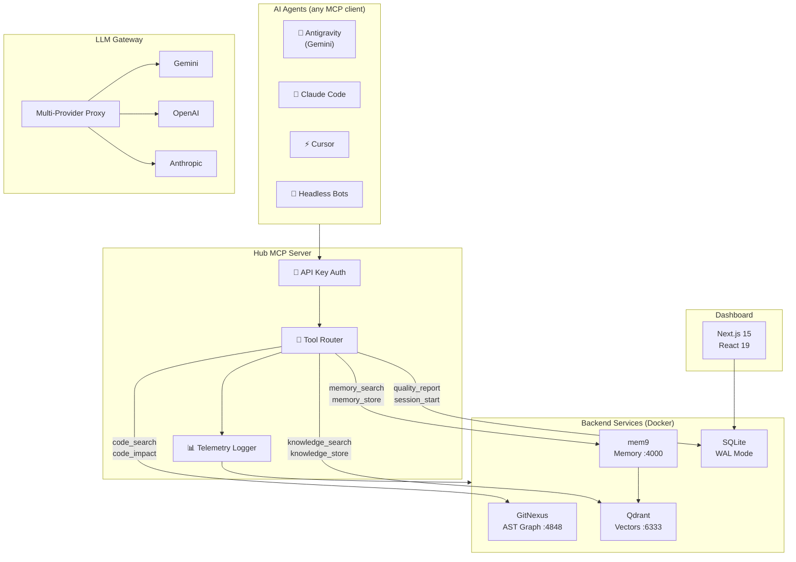

<p align="center">
  <picture>
    <source media="(prefers-color-scheme: dark)" srcset="docs/assets/logo-placeholder.svg">
    
  </picture>
</p>

<h1 align="center">Cortex Hub</h1>

<p align="center">
  <strong>Self-hosted AI Agent Intelligence Platform</strong><br/>
  <em>Unified MCP gateway · Persistent memory · Code intelligence · Quality enforcement</em>
</p>

<p align="center">
  <a href="#why-cortex">Why Cortex</a> ·
  <a href="#architecture">Architecture</a> ·
  <a href="#features">Features</a> ·
  <a href="#quick-start">Quick Start</a> ·
  <a href="#mcp-tools">MCP Tools</a> ·
  <a href="#docs">Docs</a>
</p>

<p align="center">
  
  
  
  
  
  
</p>

---

## Why Cortex?

Every AI coding agent today works in **isolation** — no shared memory, no knowledge transfer, no quality tracking. When you switch between Claude Code, Cursor, Gemini, or a headless bot, each starts from zero.

**Cortex Hub** solves this by providing a single self-hosted backend that **all your agents connect to** via the [Model Context Protocol (MCP)](https://modelcontextprotocol.io/):

```
                    You
                     │
        ┌────────────┼────────────┐
        ▼            ▼            ▼
   Claude Code    Cursor     Antigravity
        │            │            │
        └────────────┼────────────┘
                     │
              ┌──────▼──────┐
              │  Cortex Hub │  ← single MCP endpoint
              │             │
              │  Memory     │  Agents remember across sessions
              │  Knowledge  │  Shared, searchable knowledge base
              │  Code Intel │  AST-aware search + impact analysis
              │  Quality    │  Build/typecheck/lint enforcement
              │  Sessions   │  Cross-agent task handoff
              └─────────────┘
```

> **Zero data leaves your infrastructure.** Every component runs on your own server behind a Cloudflare Tunnel.

---

## Architecture



### Network Topology

```
Internet
  │
  ├── cortex-mcp.jackle.dev ──── Hub MCP Server (Hono, SSE + JSON-RPC)
  ├── cortex-api.jackle.dev ──── Dashboard API  (Hono + SQLite)
  ├── cortex-llm.jackle.dev ──── LLM Gateway    (multi-provider proxy)
  └── hub.jackle.dev ─────────── Dashboard UI   (Next.js static export)
                                    │
                              Cloudflare Tunnel
                                    │
                          ┌─────────┼─────────┐
                          │  Docker Compose    │
                          │  ├─ dashboard-api  │
                          │  ├─ hub-mcp        │
                          │  ├─ qdrant         │
                          │  ├─ gitnexus       │
                          │  └─ watchtower     │
                          └────────────────────┘
                          All ports internal.
                          Zero open ports on host.
```

---

## Features

### 🧠 Code Intelligence — GitNexus + mem9

| Capability | How It Works |
|---|---|
| **Semantic code search** | Natural language → AST-aware results across all repos |
| **360° symbol context** | Every caller, callee, import chain for any function/class |
| **Blast radius analysis** | See downstream impact before editing (`cortex_code_impact`) |
| **Execution flow tracing** | Follow code paths across files and modules |
| **Multi-repo indexing** | All repositories in a single knowledge graph |
| **Auto-embedding** | mem9 indexes repos into Qdrant with smart chunking |

### 💾 Persistent Agent Memory

Agents **remember** across sessions and conversations.

```
Session 1 (Claude Code):  "The auth middleware uses JWT with RS256"
                                    ↓ cortex_memory_store
Session 2 (Cursor):        cortex_memory_search("auth middleware") 
                                    → "JWT with RS256" ✓
```

- Per-agent isolation with optional shared spaces
- Semantic recall (search by meaning, not keywords)
- Automatic deduplication and relevance ranking

### 📚 Shared Knowledge Base — Qdrant

Agents contribute and consume a team-wide knowledge base:

- **Auto-contribution** — agents store bug fixes, patterns, and decisions during work
- **Semantic search** — find relevant knowledge by concept, not exact match
- **Tag & project filtering** — organized by domain and repository
- **Cross-project sharing** — deployment patterns, API conventions, etc.

### 🔀 LLM API Gateway

Centralized proxy for all LLM/embedding calls:

- **Multi-provider** — Gemini, OpenAI, Anthropic, or any OpenAI-compatible API
- **Ordered fallback chains** — automatic retry on 429 / 502 / 503 / 504
- **Gemini ↔ OpenAI format translation** — handled transparently
- **Budget enforcement** — daily/monthly token limits from Dashboard
- **Usage logging** — exact token counts per agent, model, and day
- **OpenAI-compatible** — `/v1/embeddings` + `/v1/chat/completions`

### 🛡️ Quality Gates

4-dimension scoring after every work session:

| Dimension | Weight | What It Measures |
|-----------|--------|-----------------|
| Build | 25 | Code compiles without errors |
| Regression | 25 | No existing tests broken |
| Standards | 25 | Follows code-conventions.md |
| Traceability | 25 | Changes linked to requirements |

Grades A→F with trend tracking. Auto-generated git hooks via `project-profile.json`.

### 🔄 Session Handoff

One agent picks up where another left off:

- **Structured context** — files changed, decisions made, blockers
- **API key tracking** — see which key initiated each session
- **Priority queue** — pick up the most important work first
- **Auto-expiry** — stale handoffs expire after 7 days

### 📊 Dashboard

Real-time monitoring and management:

- Service health (Qdrant, GitNexus, mem9, MCP)
- Query analytics per project (total queries, active agents)
- LLM usage — token consumption by model, agent, day/week/month
- Provider management — add/test/configure with smart model discovery
- Project management — repo indexing, embedding status
- Quality reports with grade trends

---

## MCP Tools

Cortex exposes **12 tools** via a single MCP endpoint. Any MCP-compatible client can use them:

| # | Tool | Purpose |
|---|------|---------|
| 1 | `cortex_session_start` | Start a development session, get project context |
| 2 | `cortex_session_end` | Close session, persist summary |
| 3 | `cortex_changes` | Check for unseen code changes from other agents |
| 4 | `cortex_code_search` | AST-aware semantic code search (GitNexus) |
| 5 | `cortex_code_impact` | Blast radius analysis before editing |
| 6 | `cortex_code_reindex` | Trigger re-indexing after code changes |
| 7 | `cortex_memory_search` | Recall agent memories by semantic similarity |
| 8 | `cortex_memory_store` | Store findings for future recall |
| 9 | `cortex_knowledge_search` | Search shared knowledge base |
| 10 | `cortex_knowledge_store` | Contribute bug fixes, patterns, decisions |
| 11 | `cortex_quality_report` | Report build/typecheck/lint results |
| 12 | `cortex_health` | Check all backend service health |

> **Full API reference:** [`docs/api/hub-mcp-reference.md`](docs/api/hub-mcp-reference.md)

---

## Quick Start

### Prerequisites

- Docker 24+ with Compose v2
- Node.js 22 LTS
- pnpm 9.x
- A Cloudflare account (free tier)

### One-Command Install

```bash
curl -fsSL https://raw.githubusercontent.com/lktiep/cortex-hub/master/scripts/bootstrap.sh | bash
```

The bootstrap script offers two modes:

| Mode | Who | What It Does |
|------|-----|-------------|
| **Administrator** | Server owner | Full Docker stack, infra, tunnel setup |
| **Member** | Team dev | Connects local agent to an existing Hub |

### Manual Setup

```bash
# 1. Clone
git clone https://github.com/lktiep/cortex-hub.git
cd cortex-hub

# 2. Install
corepack enable && pnpm install

# 3. Configure
cp .env.example .env
# Edit .env with your API keys (Gemini, OpenAI, etc.)

# 4. Start backend
cd infra && docker compose up -d

# 5. Build & run
pnpm build && pnpm dev
```

### Connect Your Agent

Run the onboarding script in **any** project to connect your IDE agent:

```bash
# From any project directory:
bash /path/to/cortex-hub/scripts/onboard.sh

# Or with API key:
HUB_API_KEY=your-key bash onboard.sh --tool antigravity
```

The onboarding script will:
- ✅ Inject MCP config into your IDE (Claude, Cursor, Windsurf, VS Code, Gemini)
- ✅ Generate `.cortex/project-profile.json` with verify commands
- ✅ Install Lefthook git hooks (pre-commit + pre-push)
- ✅ Deploy workflow templates (`.agents/workflows/`)
- ✅ Generate agent rules (`.cortex/agent-rules.md`)

### Verify

```bash
curl https://cortex-api.jackle.dev/health     # Dashboard API
curl https://cortex-mcp.jackle.dev/health     # MCP Server
```

---

## Tech Stack

| Layer | Technology | Role |
|---|---|---|
| **MCP Server** | Hono (Node.js, Docker) | Streamable HTTP + JSON-RPC gateway |
| **Code Intel** | GitNexus | AST parsing, execution flow, impact analysis |
| **Embeddings** | mem9 + Qdrant | Auto-index repos → vector search |
| **LLM Proxy** | Hono | Multi-provider gateway with fallback chains |
| **App DB** | SQLite (WAL) | Sessions, quality, usage, providers, budgets |
| **API** | Hono | Dashboard backend REST API |
| **Frontend** | Next.js 15 + React 19 | Dashboard web interface (static export) |
| **Infra** | Docker Compose | Service orchestration |
| **Tunnel** | Cloudflare Tunnel | Secure exposure, zero open ports |
| **Hooks** | Lefthook | Git hooks from `project-profile.json` |
| **Monorepo** | pnpm + Turborepo | Build orchestration + caching |

---

## Project Structure

```
cortex-hub/
├── apps/
│   ├── hub-mcp/                 # MCP Server (Hono, Streamable HTTP)
│   │   └── src/tools/           #   12 MCP tool implementations
│   ├── dashboard-api/           # Dashboard Backend (Hono + SQLite)
│   │   ├── routes/llm.ts        #   LLM Gateway (multi-provider proxy)
│   │   ├── routes/quality.ts    #   Quality gates + session handoffs
│   │   └── routes/stats.ts      #   Analytics + telemetry ingestion
│   └── dashboard-web/           # Dashboard Frontend (Next.js 15)
│       └── src/app/             #   12 pages: dashboard, sessions, quality, ...
├── packages/
│   ├── shared-types/            # TypeScript type definitions
│   ├── shared-utils/            # Logger, error classes, common utilities
│   └── shared-mem9/             # Embedding pipeline + vector store client
├── infra/
│   └── docker-compose.yml       # Qdrant, GitNexus, Watchtower
├── scripts/
│   ├── bootstrap.sh             # One-command install (admin + member modes)
│   └── onboard.sh               # Universal agent onboarding (6 IDE tools)
├── templates/
│   └── workflows/               # Portable workflow templates for any project
├── docs/                        # Architecture, API reference, guides
├── .cortex/                     # Project profile + code conventions
└── .agents/workflows/           # Active workflow definitions (/code, /continue, /phase)
```

---

## Docs

| Document | Description |
|---|---|
| [`docs/architecture/overview.md`](docs/architecture/overview.md) | System architecture with Mermaid diagrams |
| [`docs/architecture/llm-gateway.md`](docs/architecture/llm-gateway.md) | LLM Gateway: fallback chains, budget, usage |
| [`docs/architecture/monorepo-structure.md`](docs/architecture/monorepo-structure.md) | Package graph and dependency flow |
| [`docs/architecture/agent-quality-strategy.md`](docs/architecture/agent-quality-strategy.md) | Quality gates, scoring, and enforcement |
| [`docs/api/hub-mcp-reference.md`](docs/api/hub-mcp-reference.md) | Full MCP tool API reference |
| [`docs/api/database-schema.md`](docs/api/database-schema.md) | Database schema reference |
| [`docs/database/erd.md`](docs/database/erd.md) | Entity-relationship diagram |
| [`docs/guides/installation.md`](docs/guides/installation.md) | Full installation guide |
| [`docs/guides/onboarding.md`](docs/guides/onboarding.md) | Agent onboarding walkthrough |
| [`.cortex/code-conventions.md`](.cortex/code-conventions.md) | Code conventions and standards |

---

## Roadmap

| Phase | Scope | Status |
|---|---|---|
| **Phase 1** | Server + Cloudflare Tunnel | ✅ |
| **Phase 2** | Monorepo skeleton + shared packages | ✅ |
| **Phase 3** | Docker stack (Qdrant, GitNexus, Watchtower) | ✅ |
| **Phase 4** | Hub MCP Server (12 tools) | ✅ |
| **Phase 5** | Dashboard Frontend (Next.js 15) | ✅ |
| **Phase 6** | Polish, docs, testing, GA | 🔄 |

### Recent

- ✅ LLM API Gateway with multi-provider fallback + budget enforcement
- ✅ Global MCP telemetry — all tool calls logged to dashboard analytics
- ✅ Workflow templates deployed via `onboard.sh` to any project
- ✅ mem9 embedding pipeline (repo → Qdrant)
- ✅ Smart provider model discovery (no hardcoded lists)
- ✅ API key identity tracking (agent_id + api_key_name)
- ✅ Lefthook git hooks auto-generated from project profile

### Planned

- [ ] Streaming chat completions via LLM gateway
- [ ] Agent performance leaderboard
- [ ] Interactive knowledge graph visualization
- [ ] Slack/Discord notification integrations
- [ ] Plugin marketplace for community skills

---

## Cost

Cortex is designed for **near-zero** infrastructure cost:

| Component | Cost |
|---|---|
| Self-hosted server | Your existing hardware or VM |
| Cloudflare Tunnel | Free |
| Qdrant (Docker) | Free (self-hosted) |
| LLM API calls | Pay-per-use via your own keys |
| **Total** | **≈ $0 + LLM token usage** |

---

## Contributing

See the [Contributing Guide](docs/CONTRIBUTING.md) for development setup, commit conventions, and code standards.

## License

MIT © Cortex Hub Contributors
