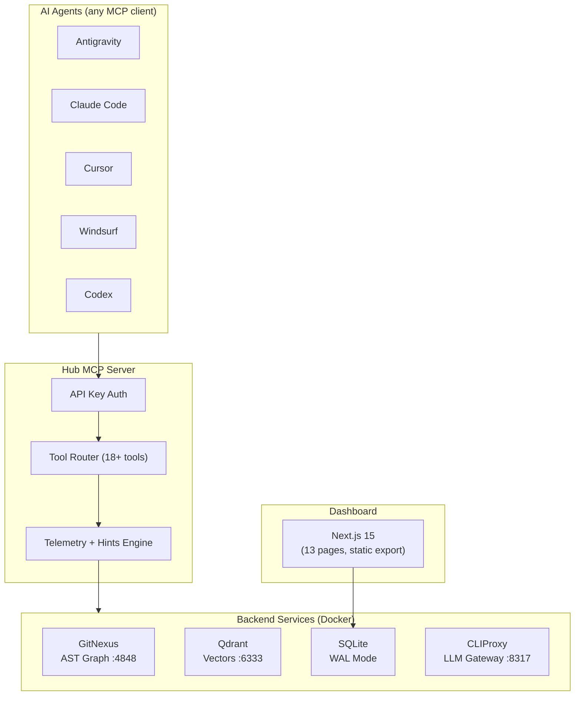

<p align="center">
  <picture>
    <source media="(prefers-color-scheme: dark)" srcset="docs/assets/logo.png">
    
  </picture>
</p>

<h1 align="center">Cortex Hub</h1>

<p align="center">
  <strong>Self-hosted AI Agent Memory + Code Intelligence Platform</strong><br/>
  <em>One MCP endpoint for every AI agent — persistent memory, AST-aware code search, quality enforcement.</em>
</p>

<p align="center">
  <a href="#why-cortex">Why</a> ·
  <a href="#features">Features</a> ·
  <a href="#benchmarks">Benchmarks</a> ·
  <a href="#quick-start">Quick Start</a> ·
  <a href="#mcp-tools">MCP Tools</a> ·
  <a href="#docs">Docs</a>
</p>

<p align="center">
  
  
  
  
  
</p>

---

## Why Cortex?

Every AI coding agent works in **isolation** — no shared memory, no knowledge transfer, no cross-project search. When you switch from Claude Code to Cursor to Antigravity, each starts from zero.

**Cortex Hub** is a single self-hosted backend that **all your agents connect to** via the [Model Context Protocol (MCP)](https://modelcontextprotocol.io/):

```
        Claude Code    Cursor    Antigravity    Codex    Gemini
              │          │            │           │         │
              └──────────┴────────────┴───────────┴─────────┘
                                  │
                          ┌───────▼────────┐
                          │  Cortex Hub    │  ← single MCP endpoint
                          │                │
                          │  Memory        │  Hierarchical, temporal-aware
                          │  Knowledge     │  Recipe-driven auto-learning
                          │  Code Intel    │  AST graph + multi-project search
                          │  LLM Gateway   │  Multi-provider with budget
                          │  Quality Gates │  Build/typecheck/lint enforcement
                          └────────────────┘
```

> **Zero data leaves your infrastructure.** Runs on your own server behind a Cloudflare Tunnel. ~$5/month VPS handles 5+ concurrent agents.

---

## Features

### 🧠 Code Intelligence (GitNexus)

| Capability | Tool | What It Does |
|---|---|---|
| **Multi-project search** | `cortex_code_search` | Omit `repo` to scan ALL indexed projects in parallel — ranked hints |
| **360° symbol context** | `cortex_code_context` | Callers, callees, execution flows for any function/class |
| **Blast radius** | `cortex_code_impact` | See downstream impact before editing |
| **Pre-commit risk** | `cortex_detect_changes` | Analyze uncommitted changes, find affected flows |
| **Direct graph queries** | `cortex_cypher` | Cypher against the AST knowledge graph |
| **Multi-repo registry** | `cortex_list_repos` | All indexed repos discoverable by name or slug |
| **Auto-reindex** | `cortex_code_reindex` | Trigger after pushes |
| **Read source** | `cortex_code_read` | Fetch raw file content from any indexed repo |

**Smart cross-project search** (added Apr 2026): call `cortex_code_search(query: "...")` without specifying `repo` and Cortex fans out across every indexed repo, runs both flow + symbol search, and returns a ranked list with refine hints. No more `list_repos → guess → retry` loops.

### 💾 Hierarchical Memory + Knowledge

**Memory** (per-agent, semantic recall across sessions):
- `cortex_memory_store` / `cortex_memory_search`
- Branch-scoped, project-scoped, with semantic deduplication

**Knowledge Base** (team-wide, structured):
- `cortex_knowledge_store` / `cortex_knowledge_search`
- **Hall types** (MemPalace-inspired): `fact`, `event`, `discovery`, `preference`, `advice`, `general`
- **Temporal validity**: `valid_from` / `invalidated_at` — query "what was true on date X"
- **Supersession chain**: mark old facts as replaced by new ones
- **Timeline view**: `GET /api/knowledge/timeline` — chronological exploration

```typescript
// Store a fact with validity window
cortex_knowledge_store({
  title: "JWT secret rotation policy",
  content: "Rotate every 90 days, ...",
  hallType: "fact",
  validFrom: "2026-01-01"
})

// Later, when policy changes:
POST /api/knowledge/{id}/invalidate
  body: { supersededBy: "new-doc-id" }
```

### 🍳 Recipe System (Auto-Learning)

Inspired by [HKUDS/OpenSpace](https://github.com/HKUDS/OpenSpace) — Cortex captures patterns from completed work automatically:

- **Auto-capture** on `task.complete` and `session_end` — if execution log shows a non-trivial workflow, an LLM extracts it as a reusable recipe
- **Quality metrics**: `selection_count`, `applied_count`, `completion_count`, `fallback_count` per doc
- **Hybrid search ranking**: `vector_similarity * 0.6 + effective_rate * 0.3 + recency * 0.1` (only when `selection_count >= 3`)
- **Evolution**: docs with `fallback_rate > 0.4` flagged for LLM rewrite via `/health-check`
- **Lineage DAG**: parent → derived → fixed relationships tracked

Dashboard `/knowledge` page shows the **Recipe Health Panel** — capture pipeline status, quality distribution, origin breakdown (manual/captured/derived/fixed), recent capture log.

### 🔀 LLM Gateway (CLIProxy)

- **Multi-provider**: Gemini, OpenAI, Anthropic, any OpenAI-compatible
- **Ordered fallback chains** with automatic retry (429/502/503/504)
- **Format translation** (Gemini ↔ OpenAI) handled transparently
- **Budget enforcement** — daily/monthly token limits from Dashboard
- **Complexity-based routing** — `model: "auto"` selects tier based on task

### 🛡️ Quality Gates

4-dimension scoring after every session:

| Dimension | Weight | Measures |
|-----------|--------|----------|
| Build | 25 | Code compiles |
| Regression | 25 | No existing tests broken |
| Standards | 25 | Follows conventions |
| Traceability | 25 | Changes linked to requirements |

Plus **plan quality** (`cortex_plan_quality`) — 8-criterion plan assessment before execution.

### 🔒 Compliance Enforcement

- **Session compliance score** — graded A/B/C/D at session end across 5 categories (Discovery, Safety, Learning, Contribution, Lifecycle)
- **Adaptive hints** — every MCP response includes context-aware suggestions
- **Hook-enforced workflow** — `/cs` v2.0 blocks edits until knowledge + memory recall called
- **Pre-commit gates** — git commits blocked until quality gates pass

### 📊 Dashboard (13 pages)

- **Overview** — hero stats + per-project cards + recipe health
- **Sessions** — agent session list with API key tracking
- **Quality** — A→F grades with trend charts
- **Knowledge** — browse + Recipe Health Panel + capture log
- **Projects** — repo management with branch-aware indexing
- **Providers / Usage / Keys / Organizations / Settings** — full admin
- Mobile-responsive, dark theme

---

## Benchmarks

Reproducible retrieval benchmarks against industry-standard datasets, comparing Cortex Hub against [MemPalace](https://github.com/milla-jovovich/mempalace) (96.6% R@5 published baseline).

### LongMemEval-S full 500 questions

| Setup | R@5 | R@10 | NDCG@10 | Duration | Cost |
|---|---|---|---|---|---|
| **Cortex Hub (hybrid re-rank)** | **96.0%** | **97.8%** | **1.44** | 20.7 min | **$0** |
| Cortex Hub (vector only) | 93.8% | 97.0% | 1.36 | 20.7 min | $0 |
| MemPalace (raw) | 96.6% | 98.2% | 0.889 | ~5 min | $0 |

Cortex is **0.6 points behind R@5** and **0.4 points behind R@10** while running **62% ahead on NDCG@10** — top-1 placement dramatically better. Strongest on `knowledge-update` (98.7%) and `multi-session` (98.5%). Weakest on `single-session-preference` (83.3% — known trade-off, see [`benchmarks/README.md`](benchmarks/README.md#hybrid-re-ranking)).

**Hybrid re-ranking** (`vector × 0.55 + lex × 0.35 + quality × 0.05 + recency × 0.05`) overfetches top 30 from vector search and re-scores with lexical keyword overlap. Recovers 13 of 16 R@5 misses where the gold session was in rank 6-10 — net **+11 hits** vs pure vector ranking.

```bash
# Run with local embedder (no API key needed, fastest)
EMBEDDING_PROVIDER=local docker compose -f infra/docker-compose.yml up -d
pnpm --filter @cortex/benchmarks bench:longmemeval --limit 30 --stratified

# Cleanup test data
pnpm --filter @cortex/benchmarks bench:longmemeval --cleanup
```

**Status:**

| Benchmark | Status | Our Score | Reference |
|-----------|--------|-----------|-----------|
| **LongMemEval (full 500, hybrid)** | ✅ Done | **96.0% R@5, NDCG 1.44** | MemPalace 96.6% R@5, 0.89 NDCG |
| ConvoMem | 📋 Planned | TBD | MemPalace 92.9% |
| LoCoMo | 📋 Planned | TBD | — |
| MemBench | 📋 Planned | TBD | MemPalace 80.3% R@5 |

See [`benchmarks/README.md`](benchmarks/README.md) for methodology, full per-category results, and how to interpret scores.

### Embedding Provider

Cortex supports two interchangeable embedding backends:

| Provider | Model | Dim | Speed | Cost | Quality |
|---|---|---|---|---|---|
| `gemini` (default) | `gemini-embedding-exp-03-07` | 768 | ~600ms/text via API | $$ | 96.7% R@5 |
| `local` | `Xenova/all-MiniLM-L6-v2` | 384 | **~10-50ms in-process** | **Free** | **96.7% R@5** |

Switch via `EMBEDDING_PROVIDER=local` env var. Local mode runs the model in-process via [`@huggingface/transformers`](https://huggingface.co/docs/transformers.js) — no network, no API key, no rate limits, fully offline. ⚠️ Switching providers requires re-embedding existing knowledge (vector dimensions differ).

---

## Architecture



### Network Topology

```
Internet
  ├── cortex-mcp.jackle.dev ──── Hub MCP Server
  └── hub.jackle.dev ─────────── Dashboard UI
                                    │
                              Cloudflare Tunnel
                                    │
                          ┌─────────┼─────────┐
                          │  Docker Compose    │
                          │  ├─ dashboard-web  │  Nginx (UI + API proxy)
                          │  ├─ cortex-api     │  Internal API + mem9
                          │  ├─ cortex-mcp     │  18+ MCP tools
                          │  ├─ qdrant         │  vectors + knowledge
                          │  ├─ gitnexus       │  AST code graph
                          │  ├─ llm-proxy      │  CLIProxy
                          │  └─ watchtower     │  auto-update
                          └────────────────────┘
                          Zero open ports on host.
```

---

## MCP Tools

Cortex exposes **18+ tools** via a single MCP endpoint:

| # | Tool | Purpose |
|---|------|---------|
| 1 | `cortex_session_start` | Start session, get project context + relevant knowledge |
| 2 | `cortex_session_end` | Close session with compliance grade |
| 3 | `cortex_changes` | Check unseen changes from other agents |
| 4 | `cortex_code_search` | Multi-project AST/symbol search with smart fan-out |
| 5 | `cortex_code_context` | 360° symbol view |
| 6 | `cortex_code_impact` | Blast radius analysis |
| 7 | `cortex_code_read` | Read raw source from any indexed repo |
| 8 | `cortex_code_reindex` | Trigger re-indexing |
| 9 | `cortex_list_repos` | List indexed repos with names + slugs |
| 10 | `cortex_cypher` | Direct graph queries |
| 11 | `cortex_detect_changes` | Pre-commit risk analysis |
| 12 | `cortex_memory_search` | Recall agent memories |
| 13 | `cortex_memory_store` | Store findings |
| 14 | `cortex_knowledge_search` | Search knowledge base (with hall_type + asOf filters) |
| 15 | `cortex_knowledge_store` | Store knowledge with hall type + validity |
| 16 | `cortex_quality_report` | Report build/test/lint results |
| 17 | `cortex_plan_quality` | 8-criterion plan assessment |
| 18 | `cortex_tool_stats` | Token savings + tool usage analytics |
| 19 | `cortex_health` | Backend service health check |

**Cross-project search just works** — no repo lookup needed:
```typescript
cortex_code_search(query: "auth middleware jwt")  // scans ALL projects
cortex_code_search(query: "auth middleware jwt", repo: "cortex-hub")  // narrow to one
```

> Full API reference: [`docs/api/hub-mcp-reference.md`](docs/api/hub-mcp-reference.md)

---

## Quick Start

### Run Agent (No Clone Needed)

```bash
# macOS / Linux — interactive wizard
curl -fsSL https://raw.githubusercontent.com/lktiep/cortex-hub/master/scripts/run-agent.sh | bash -s -- launch

# Headless daemon with preset
curl -fsSL https://raw.githubusercontent.com/lktiep/cortex-hub/master/scripts/run-agent.sh | bash -s -- start --daemon --preset fullstack
```

```powershell
# Windows
iwr -useb "https://raw.githubusercontent.com/lktiep/cortex-hub/master/scripts/run-agent.ps1" -OutFile $env:TEMP\run-agent.ps1
& $env:TEMP\run-agent.ps1 start
```

### One-Command Project Setup

```bash
# macOS / Linux
curl -fsSL "https://raw.githubusercontent.com/lktiep/cortex-hub/master/scripts/install.sh" | bash

# Windows
iwr -useb "https://raw.githubusercontent.com/lktiep/cortex-hub/master/scripts/install.ps1" -OutFile $env:TEMP\install.ps1; & $env:TEMP\install.ps1
```

**Or inside Claude Code:** type `/install`

The installer:
- Auto-detects IDEs (Claude, Gemini, Cursor, Windsurf, VS Code, Codex)
- Configures MCP for each
- Installs enforcement hooks (`.claude/hooks/*`)
- Creates project profile with stack detection
- Auto-adds `.gitignore` entries for generated files
- Idempotent — safe to re-run

### Server Setup (Admin)

```bash
git clone https://github.com/lktiep/cortex-hub.git
cd cortex-hub
corepack enable && pnpm install
cp .env.example .env  # add API keys
cd infra && docker compose up -d
```

---

## Multi-Agent Conductor

Cortex includes an **experimental** multi-agent orchestration layer for cross-IDE task delegation. **It is not feature-complete** — agents can already create/pickup tasks, but autonomous strategy execution and smart agent matching are still WIP.

📖 See [`docs/conductor.md`](docs/conductor.md) for current capabilities, limitations, and the rough edges to expect.

---

## Tech Stack

| Layer | Technology | Role |
|---|---|---|
| **MCP Server** | Hono on Node.js | Streamable HTTP + JSON-RPC, 18+ tools |
| **Code Intel** | GitNexus | AST parsing, execution flow, Cypher graph |
| **Embeddings** | mem9 + Qdrant | Vector search with semantic recall |
| **LLM Proxy** | CLIProxy | Multi-provider with fallback chains |
| **App DB** | SQLite (WAL) | Sessions, quality, usage, knowledge metadata |
| **API** | Hono | Dashboard backend + mem9 in-process |
| **Frontend** | Next.js 15 + React 19 | Static export, served by nginx |
| **Infra** | Docker Compose | Service orchestration |
| **Tunnel** | Cloudflare Tunnel | Zero open ports |
| **Hooks** | Lefthook | Stack-aware git hooks |
| **Monorepo** | pnpm + Turborepo | Build orchestration |

---

## Project Structure

```
cortex-hub/
├── apps/
│   ├── hub-mcp/                 # MCP Server — 18+ tools
│   ├── dashboard-api/           # Hono API + mem9 + recipe pipeline
│   └── dashboard-web/           # Next.js dashboard (13 pages)
├── packages/
│   ├── shared-types/            # TS type definitions
│   ├── shared-utils/            # Logger, common utilities
│   └── shared-mem9/             # Embedding pipeline + vector store
├── benchmarks/                  # Reproducible benchmarks (LongMemEval, etc.)
├── infra/
│   ├── docker-compose.yml       # Full stack
│   └── Dockerfile.*             # Per-service builds
├── scripts/
│   ├── install.sh / .ps1        # Unified installer
│   ├── run-agent.sh / .ps1      # Agent daemon launcher
│   └── bootstrap.sh             # Admin setup
├── docs/
│   ├── architecture/            # Design docs (recipe, conductor, gateway)
│   ├── conductor.md             # ⚠️ Multi-agent orchestration (experimental)
│   └── guides/                  # Onboarding, installation, use cases
├── templates/
│   ├── skills/install/          # /install slash command
│   └── workflows/               # Workflow templates (/code, /continue)
└── .cortex/                     # Project profile + agent identity
```

---

## Docs

| Document | Description |
|---|---|
| [`docs/architecture/overview.md`](docs/architecture/overview.md) | System architecture with diagrams |
| [`docs/architecture/recipe-system.md`](docs/architecture/recipe-system.md) | Recipe System (auto-learning from execution) |
| [`docs/architecture/llm-gateway.md`](docs/architecture/llm-gateway.md) | LLM Gateway design |
| [`docs/architecture/agent-quality-strategy.md`](docs/architecture/agent-quality-strategy.md) | Quality gates + scoring |
| [`docs/conductor.md`](docs/conductor.md) | Multi-agent conductor (experimental) |
| [`docs/api/hub-mcp-reference.md`](docs/api/hub-mcp-reference.md) | Full MCP tool API reference |
| [`benchmarks/README.md`](benchmarks/README.md) | Benchmark methodology + results |
| [`docs/guides/installation.md`](docs/guides/installation.md) | Full installation guide |
| [`docs/guides/use-cases.md`](docs/guides/use-cases.md) | Use cases + system requirements |

---

## System Requirements

| Resource | Minimum | Recommended | Notes |
|----------|---------|-------------|-------|
| **CPU** | 2 vCPU | 4 vCPU | Qdrant vector search is CPU-bound |
| **RAM** | 4 GB | 8 GB | Qdrant + GitNexus + Node services |
| **Disk** | 20 GB | 50 GB | Vector indices grow with knowledge |
| **OS** | Ubuntu 22.04+ | Ubuntu 24.04 LTS | Any Linux with Docker 24+ |

**Best value:** Hetzner CX22 (~$4.50/mo) handles 3-5 agents.

---

## Cost

| Component | Cost | Notes |
|---|---|---|
| Linux server | $4.50/mo+ | Hetzner CX22 minimum |
| Cloudflare Tunnel | Free | No open ports |
| All services | Free | Self-hosted in Docker |
| LLM API calls | Pay-per-use | Your own keys, budget-controlled |
| **Total** | **~$5/mo + LLM usage** | |

---

## Contributing

See [Contributing Guide](docs/CONTRIBUTING.md) for development setup, commit conventions, and code standards.

## License

MIT © Cortex Hub Contributors
