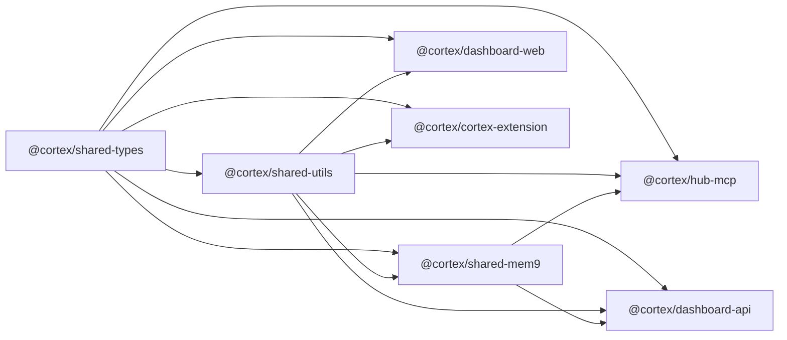

# Monorepo Structure

> Cortex uses a **pnpm workspace + Turborepo** monorepo. All packages share types, utilities, and build pipelines.

---

## Directory Layout

```
cortex-hub/
├── packages/                           # Shared libraries
│   ├── shared-types/                   # TypeScript type definitions
│   │   └── src/
│   │       ├── api.ts                  # Request/response contracts
│   │       ├── models.ts              # Domain models (Knowledge, Quality, Session)
│   │       └── index.ts
│   ├── shared-utils/                   # Common utility functions
│   │   └── src/
│   │       ├── logger.ts              # Structured logging
│   │       ├── crypto.ts              # API key hashing
│   │       └── index.ts
│   └── shared-mem9/                    # Memory engine (in-process)
│       └── src/
│           ├── types.ts               # Mem9Config, MemoryItem, etc.
│           ├── embedder.ts            # Gemini/OpenAI embedding client
│           ├── vector-store.ts        # Qdrant REST client
│           ├── llm.ts                 # CLIProxy chat completions
│           ├── memory.ts              # Core Mem9 class
│           └── index.ts
│
├── apps/
│   ├── hub-mcp/                        # Hub MCP Server (Hono + Streamable HTTP)
│   │   └── src/
│   │       ├── index.ts               # Hono app + MCP transport
│   │       ├── api-call.ts            # HTTP client + telemetry
│   │       ├── middleware/
│   │       │   └── auth.ts            # API key validation
│   │       └── tools/                 # One file per tool group
│   │           ├── code.ts            # code_search, code_impact, code_context, code_read, list_repos, cypher, detect_changes
│   │           ├── memory.ts          # memory_store, memory_search
│   │           ├── knowledge.ts       # knowledge_store, knowledge_search
│   │           ├── indexing.ts        # code_reindex
│   │           ├── quality.ts         # quality_report
│   │           ├── session.ts         # session_start, session_end
│   │           ├── changes.ts         # changes (unseen commits)
│   │           ├── analytics.ts       # tool_stats
│   │           ├── health.ts          # health check
│   │           └── tasks.ts           # task CRUD + strategy
│   │
│   ├── dashboard-api/                  # Backend API (Hono + SQLite)
│   │   └── src/
│   │       ├── index.ts               # Hono app + routes
│   │       ├── routes/                # REST endpoints
│   │       │   ├── health.ts
│   │       │   ├── knowledge.ts       # Knowledge CRUD + search + lineage + health-check
│   │       │   ├── intel.ts           # GitNexus proxy (search, impact, context, etc.)
│   │       │   ├── indexing.ts        # Index job management
│   │       │   ├── conductor.ts       # Task orchestration
│   │       │   ├── llm.ts             # LLM proxy (chat, embeddings)
│   │       │   ├── organizations.ts   # Org/project management + project lookup
│   │       │   ├── quality.ts         # Quality reports
│   │       │   ├── setup.ts           # Setup wizard
│   │       │   ├── stats.ts           # Usage analytics
│   │       │   ├── webhooks.ts        # Change events + ack
│   │       │   └── sessions.ts        # Session management
│   │       ├── services/              # Business logic
│   │       │   ├── indexer.ts         # Clone → GitNexus analyze → mem9 embed
│   │       │   ├── mem9-embedder.ts   # Code embedding pipeline
│   │       │   ├── docs-knowledge-builder.ts  # Docs → knowledge
│   │       │   ├── recipe-capture.ts  # Auto-capture recipes
│   │       │   └── knowledge-evolution.ts     # FIX evolution
│   │       ├── db/
│   │       │   ├── schema.sql         # Full DDL (20 tables)
│   │       │   └── client.ts          # SQLite client + migrations
│   │       └── utils/
│   │           └── error-handler.ts
│   │
│   ├── dashboard-web/                  # Frontend (Next.js 15)
│   │   └── src/
│   │       ├── app/                    # App Router pages
│   │       │   ├── layout.tsx
│   │       │   ├── page.tsx           # Overview
│   │       │   ├── settings/          # Settings + provider config
│   │       │   └── setup/             # Setup wizard
│   │       ├── lib/
│   │       │   ├── api.ts             # API client
│   │       │   └── config.ts          # URL config
│   │       └── components/            # UI components (inline)
│   │
│   └── cortex-extension/               # VS Code extension
│       └── src/
│           ├── config.ts              # Extension config
│           └── hub-api.ts             # Hub API client
│
├── infra/                              # Infrastructure as Code
│   ├── docker-compose.yml             # Production stack
│   ├── Dockerfile.dashboard-api
│   ├── Dockerfile.gitnexus
│   ├── Dockerfile.hub-mcp
│   └── nginx-dashboard.conf           # Nginx proxy config
│
├── scripts/                            # Deployment scripts
│   ├── install.sh                     # All-in-one installer
│   ├── install-hub.sh                 # Hub setup
│   ├── onboard.sh / onboard.ps1       # Agent onboarding
│   ├── cortex-worker.sh               # Headless worker
│   ├── cortex-listen.sh               # Task listener
│   └── deploy.sh                      # Rebuild + force-recreate
│
├── docs/                               # Project documentation
│   ├── architecture/
│   ├── database/
│   ├── guides/
│   ├── api/
│   └── policies/
│
├── .github/workflows/                  # CI/CD
│   ├── ci.yml
│   └── deploy.yml
│
├── turbo.json                          # Turborepo pipeline config
├── pnpm-workspace.yaml
├── package.json
├── tsconfig.json
├── eslint.config.mjs
├── .prettierrc
└── README.md
```

---

## Package Dependency Graph



---

## Import Conventions

```typescript
// ✅ Always import from shared packages using path aliases
import type { KnowledgeItem, QualityReport } from '@cortex/shared-types'
import { formatDate, hashApiKey } from '@cortex/shared-utils'
import { Embedder, VectorStore } from '@cortex/shared-mem9'

// ❌ Never duplicate shared logic in app code
// ❌ Never use relative cross-package imports
```
