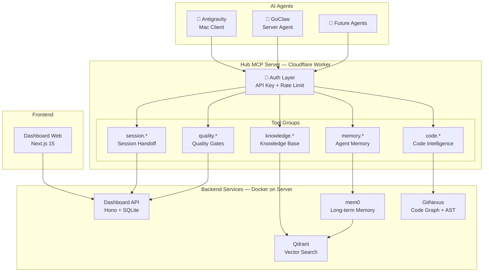

# Cortex Architecture Overview

> A centralized intelligence hub that connects AI coding agents through a unified MCP (Model Context Protocol) interface, providing shared code intelligence, persistent memory, knowledge management, and quality enforcement.

---

## System Architecture



---

## Core Components

### 1. Hub MCP Server (Cloudflare Worker)

The central gateway. All agents connect to this single endpoint. It handles authentication, rate limiting, policy enforcement, and request routing.

| Tool Group | Backend | Purpose |
|---|---|---|
| `code.query`, `code.context`, `code.impact` | GitNexus | AST-aware code search, symbol context, blast radius |
| `memory.add`, `memory.search` | mem0 | Persistent agent memory across sessions |
| `knowledge.search`, `knowledge.contribute` | Qdrant | Shared knowledge base with vector search |
| `quality.report`, `quality.trends` | SQLite | Quality score tracking and enforcement |
| `session.handoff`, `session.pickup` | SQLite | Cross-agent task continuity |

### 2. GitNexus (Code Intelligence)

Provides deep code understanding via Tree-sitter AST parsing and graph analysis:

- **Multi-repo indexing** — all project repos indexed into a single registry
- **Execution flow tracing** — maps how code flows through the system
- **Impact analysis** — blast radius calculation before any change
- **Community detection** — Leiden algorithm clusters related code
- **Symbol context** — 360° view of any function, class, or method

### 3. mem0 (Agent Memory)

Long-term memory for AI agents, backed by Qdrant (vectors):

- Remembers decisions, patterns, and context across sessions
- Each agent has isolated memory with optional shared spaces
- Automatic deduplication and relevance ranking

### 4. Qdrant (Knowledge Store)

High-performance vector database for semantic knowledge search:

- Knowledge items contributed by agents during work sessions
- Cross-project knowledge sharing (e.g., deployment patterns)
- Hybrid search: keyword + semantic vector matching

### 5. Dashboard API + Web

Monitoring and management interface:

- Real-time service health monitoring
- Knowledge item curation (approve/reject)
- Quality score trending per project
- Session handoff management
- Third-party dependency update checker

---

## Design Principles

| Principle | Application |
|---|---|
| **SOLID** | Abstract tool classes, injected service clients, single-responsibility services |
| **Code Reuse First** | Shared packages (`shared-types`, `shared-utils`, `ui-components`) |
| **Privacy First** | All data stays on your infrastructure — zero external data sharing |
| **Zero Vendor Lock-in** | All components are open source (MIT/Apache 2.0) |
| **Incremental Adoption** | Each component works independently; enable what you need |

---

## Network Topology

```
Internet
  │
  ├── hub.yourdomain.com ──── Cloudflare Worker (Hub MCP)
  │
  └── Cloudflare Tunnel ──┬── :4000  Dashboard API
                          ├── :3000  Dashboard Web
                          ├── :3200  GitNexus
                          ├── :8080  mem0
                          └── :6333  Qdrant
```

All backend services run behind a Cloudflare Tunnel — **no open ports** on the server.
