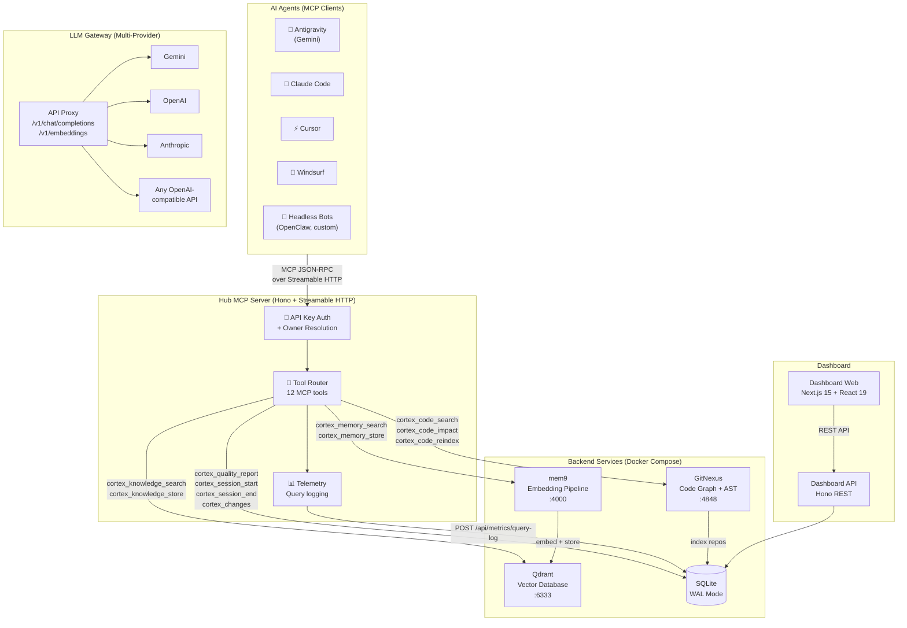
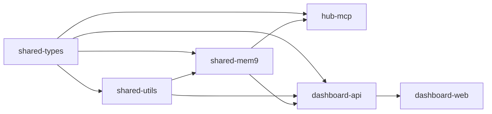

# Cortex Hub — Architecture Overview

> A self-hosted intelligence platform that connects AI coding agents through a unified **MCP (Model Context Protocol)** interface. Provides shared code intelligence, persistent memory, a collaborative knowledge base, quality enforcement, and cross-agent session continuity — all running on your own infrastructure.

---

## System Architecture



---

## Core Components

### 1. Hub MCP Server (`apps/hub-mcp`)

The **central gateway** for all agent interactions. Agents connect to a single endpoint (`cortex-mcp.jackle.dev/mcp`) and access all capabilities through MCP tools.

**Transport:** Streamable HTTP (POST with JSON-RPC payloads, SSE for streaming responses)

**Key features:**
- API key authentication with owner identity resolution (`X-API-Key-Owner`)
- Stateless transport — no session affinity needed
- Global telemetry: every `tools/call` is parsed, timed, and logged to dashboard analytics
- 12 tools spanning code intelligence, memory, knowledge, quality, and sessions

| Tool Group | Tools | Backend |
|---|---|---|
| **Code Intelligence** | `cortex_code_search`, `cortex_code_impact`, `cortex_code_reindex` | GitNexus |
| **Agent Memory** | `cortex_memory_search`, `cortex_memory_store` | mem9 → Qdrant |
| **Knowledge Base** | `cortex_knowledge_search`, `cortex_knowledge_store` | Qdrant + SQLite |
| **Quality Gates** | `cortex_quality_report` | SQLite |
| **Sessions** | `cortex_session_start`, `cortex_session_end`, `cortex_changes` | SQLite |
| **Health** | `cortex_health` | All services |

### 2. GitNexus (Code Intelligence)

Standalone Docker service (HTTP eval-server on `:4848`). Provides deep code understanding via **Tree-sitter AST parsing** and graph analysis:

- **Multi-repo indexing** — all project repos in a single registry
- **Execution flow tracing** — maps code flow across files and modules
- **Impact analysis** — blast radius calculation before changes
- **Community detection** — Leiden algorithm clusters related code
- **Symbol context** — 360° view of any function, class, or method
- **HTTP API** — `POST /tool/query`, `/tool/impact`, `/tool/context`

### 3. mem9 (Embedding Pipeline + Agent Memory)

Long-term memory for AI agents, backed by **Qdrant** vectors:

- Remembers decisions, patterns, and context across sessions
- Per-agent isolation with optional shared spaces
- Automatic deduplication and relevance ranking
- Auto-indexes repository content into Qdrant with smart chunking
- Scoped memory: agent-level → project-level → branch-level

### 4. Qdrant (Vector Database)

High-performance vector database for semantic search:

- Knowledge items contributed by agents during work sessions
- Hybrid search: keyword + semantic vector matching
- Cross-project knowledge sharing (deployment patterns, API conventions, etc.)

### 5. LLM API Gateway (`routes/llm.ts`)

Centralized LLM proxy with intelligent routing:

- **Multi-provider** — Gemini, OpenAI, Anthropic, any OpenAI-compatible API
- **Ordered fallback chains** — automatic retry on 429/502/503/504
- **Format translation** — Gemini ↔ OpenAI format handled transparently
- **Budget enforcement** — daily/monthly token limits
- **Usage logging** — exact token counts per agent, model, day
- **Smart model discovery** — queries provider APIs, no hardcoded model lists

### 6. Dashboard API + Web (`apps/dashboard-api` + `apps/dashboard-web`)

Full monitoring and management interface:

- Real-time service health (Qdrant, GitNexus, mem9, MCP)
- Per-project query analytics (agents, tools, latency)
- Quality report trending with grade history
- Session management with API key tracking
- LLM provider configuration with model discovery
- Usage analytics with budget controls
- Organization and project management

---

## Design Principles

| Principle | Application |
|---|---|
| **Self-Hosted First** | All data stays on your infrastructure — zero external data sharing |
| **MCP Standard** | Compliant with the Model Context Protocol for universal agent compatibility |
| **Zero Vendor Lock-in** | All components are open source; swap any service freely |
| **Incremental Adoption** | Each capability works independently; enable what you need |
| **Prescriptive Workflows** | Agents follow explicit, documented workflows — not suggestions |
| **Eat Our Own Dogfood** | Cortex Hub is built using Cortex Hub tools |

---

## Network Topology

```
Internet
  │
  ├── hub.jackle.dev ─────────── Dashboard UI      (Cloudflare Access protected)
  ├── cortex-api.jackle.dev ──── Dashboard API      (:4000, Hono REST)
  ├── cortex-mcp.jackle.dev ──── Hub MCP Server     (Streamable HTTP, JSON-RPC)
  └── cortex-llm.jackle.dev ──── LLM Gateway        (OpenAI-compatible proxy)
                                    │
                              Cloudflare Tunnel (cloudflared)
                                    │
                          ┌─────────────────────────┐
                          │   Docker Compose Stack   │
                          │                          │
                          │   dashboard-api  :4000   │
                          │   hub-mcp        :4001   │
                          │   qdrant         :6333   │
                          │   gitnexus       :4848   │
                          │   watchtower     (auto)  │
                          │                          │
                          │   Zero open ports.       │
                          │   All traffic via tunnel. │
                          └─────────────────────────┘
```

---

## Data Flow

### Agent → Tool Call → Result

```
1. Agent sends JSON-RPC POST to cortex-mcp.jackle.dev/mcp
2. Hub MCP authenticates via API key header
3. Router identifies tool (e.g., cortex_code_search)
4. Tool handler calls appropriate backend (GitNexus, Qdrant, SQLite)
5. Response returned to agent
6. Telemetry logger records: agent_id, tool, latency_ms, project_id, status
```

### Telemetry Pipeline

```
Agent → tools/call → Hub MCP intercepts body →
  parse tool name + projectId + args →
  execute tool →
  POST /api/metrics/query-log { agent, tool, latencyMs, status, projectId } →
  dashboard analytics (query_logs table)
```

---

## Monorepo Package Graph



> See [`docs/architecture/monorepo-structure.md`](monorepo-structure.md) for detailed package descriptions.
