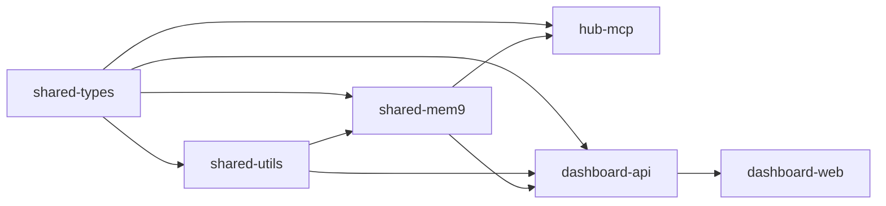

# Cortex Hub — Architecture Overview

> A self-hosted intelligence platform that connects AI coding agents through a unified **MCP (Model Context Protocol)** interface. Provides shared code intelligence, persistent memory, a collaborative knowledge base, quality enforcement, and cross-agent session continuity — all running on your own infrastructure.

---

## System Architecture

```mermaid
graph TB
    subgraph Agents["AI Agents (MCP Clients)"]
        AG["🤖 Antigravity<br/>(Gemini)"]
        CC["🐙 Claude Code"]
        CU["⚡ Cursor"]
        WS["🌊 Windsurf"]
        BOT["🤖 Headless Bots<br/>(OpenClaw, custom)"]
    end

    subgraph MCP["Hub MCP Server (Hono + Streamable HTTP)"]
        AUTH["🔐 API Key Auth<br/>Bearer tokens"]
        ROUTER["🔀 Tool Router<br/>17+ MCP tools"]
        TEL["📊 Telemetry<br/>Query logging"]
    end

    subgraph Backend["Backend Services (Docker Compose)"]
        GN["GitNexus<br/>Code Graph + AST<br/>:4848"]
        API["Dashboard API<br/>Hono + SQLite<br/>:4000"]
        QD["Qdrant<br/>Vector Database<br/>:6333"]
        LP["CLIProxy (LLM Gateway)<br/>OAuth-based<br/>:8317"]
        MCP_SVC["Hub MCP<br/>Hono Node.js<br/>:8317"]
    end

    subgraph LLM["LLM Providers"]
        GEM["Gemini"]
        OAI["OpenAI"]
        ANT["Anthropic"]
        OTHER["Any OpenAI-<br/>compatible API"]
    end

    subgraph Dashboard["Dashboard"]
        WEB["Dashboard Web<br/>Next.js 15 + React 19"]
    end

    Agents -->|"MCP JSON-RPC<br/>over Streamable HTTP"| AUTH
    AUTH --> ROUTER
    ROUTER --> TEL

    ROUTER -->|"cortex_code_search<br/>cortex_code_impact<br/>cortex_code_context<br/>cortex_code_read<br/>cortex_list_repos<br/>cortex_cypher<br/>cortex_detect_changes"| GN
    ROUTER -->|"cortex_code_reindex"| API
    ROUTER -->|"cortex_memory_search<br/>cortex_memory_store"| API
    ROUTER -->|"cortex_knowledge_search<br/>cortex_knowledge_store"| API
    ROUTER -->|"cortex_quality_report<br/>cortex_session_start<br/>cortex_session_end<br/>cortex_changes<br/>cortex_tool_stats<br/>cortex_task_*"| API

    TEL -->|"POST /api/metrics/query-log"| API

    API -->|"embed + search"| QD
    API -->|"analyze repos"| GN
    API -->|"LLM calls via"| LP

    LP --> GEM & OAI & ANT & OTHER
    WEB -->|"REST API (same-origin)| API
```

---

## Core Components

### 1. Hub MCP Server (`apps/hub-mcp`)

The **central gateway** for all agent interactions. Agents connect to a single endpoint and access all capabilities through MCP tools.

**Transport:** Streamable HTTP (POST with JSON-RPC payloads, SSE for streaming responses)

**Key features:**
- API key authentication with owner identity resolution
- Stateless transport — no session affinity needed
- Global telemetry: every `tools/call` is parsed, timed, and logged to dashboard analytics
- 17+ tools spanning code intelligence, memory, knowledge, quality, sessions, tasks, and analytics

| Tool Group | Tools | Backend |
|---|---|---|
| **Code Intelligence** | `cortex_code_search`, `cortex_code_impact`, `cortex_code_context`, `cortex_code_read`, `cortex_list_repos`, `cortex_cypher`, `cortex_detect_changes` | GitNexus |
| **Agent Memory** | `cortex_memory_search`, `cortex_memory_store` | Dashboard API → mem9 → Qdrant |
| **Knowledge Base** | `cortex_knowledge_search`, `cortex_knowledge_store` | Dashboard API → Qdrant + SQLite |
| **Quality Gates** | `cortex_quality_report` | Dashboard API → SQLite |
| **Sessions** | `cortex_session_start`, `cortex_session_end` | Dashboard API → SQLite |
| **Change Awareness** | `cortex_changes` | Dashboard API → SQLite |
| **Indexing** | `cortex_code_reindex` | Dashboard API → GitNexus |
| **Analytics** | `cortex_tool_stats` | Dashboard API → SQLite |
| **Task Management** | `cortex_task_create`, `cortex_task_pickup`, `cortex_task_accept`, `cortex_task_update`, `cortex_task_list`, `cortex_task_status`, `cortex_task_submit_strategy` | Dashboard API → SQLite |
| **Health** | `cortex_health` | All services |

### 2. GitNexus (Code Intelligence)

Standalone Docker service (HTTP eval-server on `:4848`). Provides deep code understanding via **Tree-sitter AST parsing** and graph analysis:

- **Multi-repo indexing** — all project repos in a single registry
- **Execution flow tracing** — maps code flow across files and modules
- **Impact analysis** — blast radius calculation before changes
- **Community detection** — Leiden algorithm clusters related code
- **Symbol context** — 360° view of any function, class, or method
- **Cypher queries** — direct graph exploration via Cypher
- **HTTP API** — `POST /tool/query`, `/tool/impact`, `/tool/context`

### 3. mem9 (Embedding Pipeline + Agent Memory)

Long-term memory for AI agents, backed by **Qdrant** vectors. Runs **in-process** within the Dashboard API container:

- Remembers decisions, patterns, and context across sessions
- Per-agent isolation with optional shared spaces
- Automatic deduplication and relevance ranking
- Auto-indexes repository content into Qdrant with smart chunking
- Scoped memory: agent-level → project-level → branch-level

**Indexing Pipeline:**

```
git clone → GitNexus AST analyze (with --embeddings) → Symbol extraction
                                    ↓
                     mem9 code embed (opt-in, MEM9_EMBEDDING_ENABLED) → Qdrant
                                    ↓
                        docs-knowledge-builder → Qdrant (knowledge search)
                     (scans *.md, *.mdx, *.txt, *.rst)
```

Key behaviors:
- **GitNexus embedding** (`--embeddings`) runs on every index — local AST embeddings, no API cost
- **mem9 code embedding** is **disabled by default** (`MEM9_EMBEDDING_ENABLED=false`) to save API costs. Enable for production or trigger manually via `POST /api/indexing/:id/index/mem9`
- After code embedding completes, **docs-knowledge-builder** automatically scans for documentation files, chunks, embeds, and stores as knowledge tagged `auto-docs`. On re-index, existing auto-docs are replaced.

### 4. Qdrant (Vector Database)

High-performance vector database for semantic search:

- **Code collection:** per-project code chunks from mem9 embedding
- **Knowledge collection:** agent-contributed knowledge + auto-generated docs knowledge
- Hybrid search: keyword + semantic vector matching
- Cross-project knowledge sharing (deployment patterns, API conventions, etc.)

### 5. CLIProxy (LLM Gateway)

OAuth-based LLM proxy (`:8317`) — no API keys needed:

- **Multi-provider** — Gemini, OpenAI, Anthropic, any OpenAI-compatible API
- **Ordered fallback chains** — automatic retry on 429/502/503/504
- **Format translation** — Gemini ↔ OpenAI format handled transparently
- **Budget enforcement** — daily/monthly token limits
- **Usage logging** — exact token counts per agent, model, day
- **Smart model discovery** — queries provider APIs, no hardcoded model lists

### 6. Dashboard API + Web (`apps/dashboard-api` + `apps/dashboard-web`)

Full monitoring and management interface:

- Real-time service health (Qdrant, GitNexus, CLIProxy, MCP)
- Per-project query analytics (agents, tools, latency)
- Quality report trending with grade history
- Session management with API key tracking
- LLM provider configuration with model discovery
- Usage analytics with budget controls
- Organization and project management
- Code indexing with progress tracking and branch auto-detection

---

## Design Principles

| Principle | Application |
|---|---|
| **Self-Hosted First** | All data stays on your infrastructure — zero external data sharing |
| **MCP Standard** | Compliant with the Model Context Protocol for universal agent compatibility |
| **Zero Vendor Lock-in** | All components are open source; swap any service freely |
| **Incremental Adoption** | Each capability works independently; enable what you need |
| **Prescriptive Workflows** | Agents follow explicit, documented workflows — not suggestions |
| **Eat Our Own Dogfood** | Cortex Hub is built using Cortex Hub tools |

---

## Network Topology

```
Internet
  │
  ├── hub.jackle.dev ─────────── Dashboard UI      (Cloudflare Access protected)
  ├── cortex-api.jackle.dev ──── Dashboard API      (:4000, Hono REST)
  └── cortex-mcp.jackle.dev ──── Hub MCP Server     (Streamable HTTP, JSON-RPC)
                                    │
                              Cloudflare Tunnel (cloudflared)
                                    │
                          ┌─────────────────────────┐
                          │   Docker Compose Stack   │
                          │                          │
                          │   dashboard-api  :4000   │
                          │   hub-mcp        :8317   │
                          │   qdrant         :6333   │
                          │   gitnexus       :4848   │
                          │   llm-proxy      :8317   │  ← internal only
                          │   watchtower     (auto)  │
                          │                          │
                          │   Zero open ports.       │
                          │   All traffic via tunnel. │
                          └─────────────────────────┘
```

---

## Data Flow

### Agent → Tool Call → Result

```
1. Agent sends JSON-RPC POST to cortex-mcp.jackle.dev/mcp
2. Hub MCP authenticates via API key header
3. Router identifies tool (e.g., cortex_code_search)
4. Tool handler calls appropriate backend (GitNexus, Qdrant, SQLite)
5. Response returned to agent
6. Telemetry logger records: agent_id, tool, latency_ms, project_id, status
```

### Telemetry Pipeline

```
Agent → tools/call → Hub MCP intercepts body →
  parse tool name + projectId + args →
  execute tool →
  POST /api/metrics/query-log { agent, tool, latencyMs, status, projectId, inputSize, outputSize, computeTokens, computeModel } →
  dashboard analytics (query_logs table)
```

---

## Monorepo Package Graph



> See [`docs/architecture/monorepo-structure.md`](monorepo-structure.md) for detailed package descriptions.
