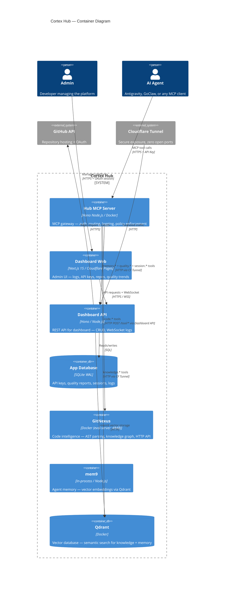
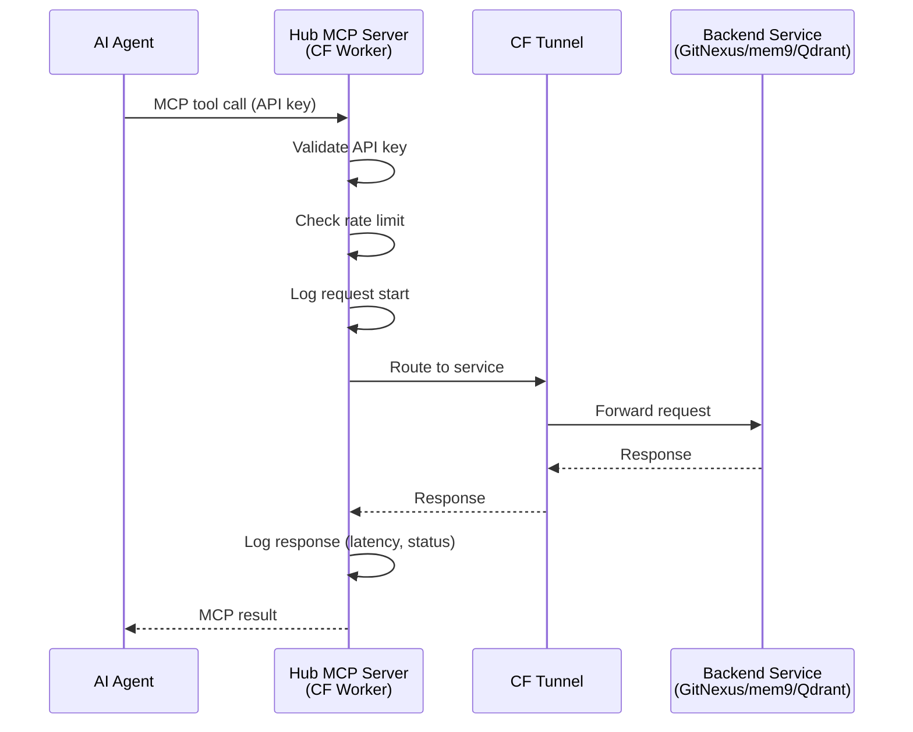
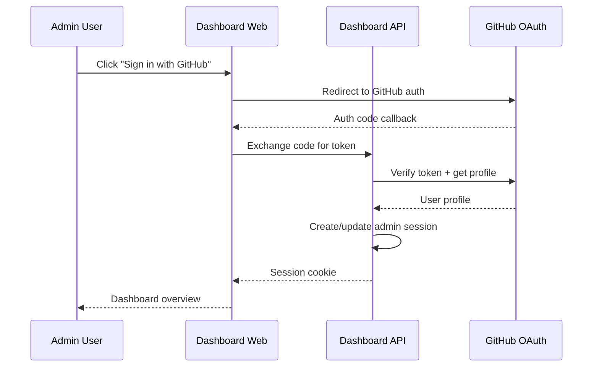
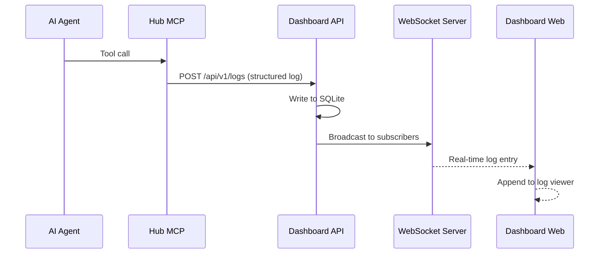

# C4 Container Diagram — Cortex Hub

```mermaid
C4Container
    title Cortex Hub — Container Diagram

    Person(admin, "Admin", "Developer managing the platform")
    Person(agent, "AI Agent", "Antigravity, GoClaw, or any MCP client")

    System_Boundary(cortex, "Cortex Hub") {
        Container(hub_mcp, "Hub MCP Server", "Hono Node.js / Docker", "MCP gateway — auth, routing, logging, policy enforcement")
        Container(dash_web, "Dashboard Web", "Next.js 15 / Cloudflare Pages", "Admin UI — logs, API keys, repos, quality trends")
        Container(dash_api, "Dashboard API", "Hono / Node.js", "REST API for dashboard — CRUD, WebSocket logs")
        ContainerDb(sqlite, "App Database", "SQLite WAL", "API keys, quality reports, sessions, logs")
        Container(gitnexus, "GitNexus", "Docker (eval-server :4848)", "Code intelligence — AST parsing, knowledge graph, HTTP API")
        Container(mem9, "mem9", "In-process / Node.js", "Agent memory — vector embeddings via Qdrant")
        ContainerDb(qdrant, "Qdrant", "Docker", "Vector database — semantic search for knowledge + memory")
    }

    System_Ext(github, "GitHub API", "Repository hosting + OAuth")
    System_Ext(cf_tunnel, "Cloudflare Tunnel", "Secure exposure, zero open ports")

    Rel(agent, hub_mcp, "MCP tool calls", "HTTPS + API Key")
    Rel(admin, dash_web, "Manages platform", "HTTPS + OAuth session")
    Rel(dash_web, dash_api, "API requests + WebSocket", "HTTPS / WSS")
    Rel(hub_mcp, gitnexus, "code.* tools", "HTTP POST /tool/* via Dashboard API")
    Rel(hub_mcp, dash_api, "memory.* + quality.* + session.* tools", "HTTP via CF Tunnel")
    Rel(hub_mcp, qdrant, "knowledge.* tools", "HTTP via CF Tunnel")
    Rel(dash_api, sqlite, "Reads/writes", "SQL")
    Rel(dash_api, qdrant, "mem9 vector storage", "HTTP")
    Rel(dash_api, github, "Repo import + OAuth", "HTTPS")
    Rel(cf_tunnel, dash_api, "Tunneled traffic", "HTTP")
```

## Data Flow — MCP Tool Call

```mermaid
sequenceDiagram
    participant Agent as AI Agent
    participant HubMCP as Hub MCP Server<br/>(CF Worker)
    participant Tunnel as CF Tunnel
    participant Service as Backend Service<br/>(GitNexus/mem9/Qdrant)

    Agent->>HubMCP: MCP tool call (API key)
    HubMCP->>HubMCP: Validate API key
    HubMCP->>HubMCP: Check rate limit
    HubMCP->>HubMCP: Log request start
    HubMCP->>Tunnel: Route to service
    Tunnel->>Service: Forward request
    Service-->>Tunnel: Response
    Tunnel-->>HubMCP: Response
    HubMCP->>HubMCP: Log response (latency, status)
    HubMCP-->>Agent: MCP result
```

## Data Flow — Dashboard Login

```mermaid
sequenceDiagram
    participant Admin as Admin User
    participant Web as Dashboard Web
    participant API as Dashboard API
    participant GH as GitHub OAuth

    Admin->>Web: Click "Sign in with GitHub"
    Web->>GH: Redirect to GitHub auth
    GH-->>Web: Auth code callback
    Web->>API: Exchange code for token
    API->>GH: Verify token + get profile
    GH-->>API: User profile
    API->>API: Create/update admin session
    API-->>Web: Session cookie
    Web-->>Admin: Dashboard overview
```

## Data Flow — Real-Time Logs

```mermaid
sequenceDiagram
    participant Agent as AI Agent
    participant HubMCP as Hub MCP
    participant API as Dashboard API
    participant WS as WebSocket Server
    participant Web as Dashboard Web

    Agent->>HubMCP: Tool call
    HubMCP->>API: POST /api/v1/logs (structured log)
    API->>API: Write to SQLite
    API->>WS: Broadcast to subscribers
    WS-->>Web: Real-time log entry
    Web-->>Web: Append to log viewer
```
