# Entity Relationship Diagram — Cortex Hub

> This ERD covers the **SQLite application database** only. Qdrant has its own schema managed by its service.

```mermaid
erDiagram
    ADMIN_USER {
        text id PK "UUID"
        text github_id UK "GitHub user ID"
        text username "GitHub username"
        text display_name "Full name"
        text avatar_url "GitHub avatar"
        text email "Contact email"
        text created_at "ISO 8601"
        text updated_at "ISO 8601"
    }

    API_KEYS {
        text id PK "UUID prefix + random"
        text name "Human-readable name"
        text key_hash UK "SHA-256 hash"
        text scope "all, knowledge, hub"
        text permissions "JSON permissions"
        text project_id "Optional project scope"
        text created_at "ISO 8601"
        text expires_at "ISO 8601 or NULL"
        text last_used_at "ISO 8601 or NULL"
    }

    ORGANIZATIONS {
        text id PK "UUID"
        text name "Organization name"
        text slug UK "URL-safe slug"
        text description
        text created_at
        text updated_at
    }

    PROJECTS {
        text id PK "UUID (proj-xxxx)"
        text org_id FK "→ organizations.id"
        text name "Project name"
        text slug "URL-safe slug"
        text description
        text git_repo_url
        text git_provider "github, gitlab, bitbucket, azure, local"
        text git_username
        text git_token
        text indexed_at "Last index timestamp"
        int indexed_symbols "Symbol count"
        text created_at
        text updated_at
    }

    INDEX_JOBS {
        text id PK "UUID (idx-xxxx)"
        text project_id FK "→ projects.id CASCADE"
        text branch "Git branch (default: auto-detected)"
        text status "pending|cloning|analyzing|done|error"
        int progress "0-100"
        int total_files
        int symbols_found
        text log "stdout/stderr"
        text error
        text commit_hash
        text commit_message
        text triggered_by "manual, webhook, setup"
        text mem9_status "pending|embedding|done|error|skipped"
        int mem9_chunks
        int mem9_progress
        int mem9_total_chunks
        text docs_knowledge_status
        int docs_knowledge_count
        text started_at
        text completed_at
        text created_at
    }

    KNOWLEDGE_DOCUMENTS {
        text id PK "UUID (kdoc-xxxx)"
        text title
        text source "manual, agent, captured, derived, fixed"
        text source_agent_id
        text project_id
        text tags "JSON array"
        text content_preview
        int chunk_count
        text status "active|archived|deprecated"
        int hit_count
        int selection_count
        int applied_count
        int completion_count
        int fallback_count
        text origin "manual|agent|captured|derived|fixed"
        int generation "DAG depth from root"
        text source_task_id
        text created_by_agent
        text category "general|workflow|tool_guide|reference|error_fix"
        text created_at
        text updated_at
    }

    KNOWLEDGE_CHUNKS {
        text id PK "UUID"
        text document_id FK "→ knowledge_documents.id CASCADE"
        int chunk_index
        text content
        int char_count
        text created_at
    }

    KNOWLEDGE_LINEAGE {
        int id PK "AUTOINCREMENT"
        text parent_id FK "→ knowledge_documents.id CASCADE"
        text child_id FK "→ knowledge_documents.id CASCADE"
        text relationship "derived|fixed"
        text change_summary
        text created_at
    }

    KNOWLEDGE_USAGE_LOG {
        int id PK "AUTOINCREMENT"
        text document_id
        text task_id
        text session_id
        text agent_id
        text action "suggested|applied|completed|fallback"
        int token_count
        text created_at
    }

    CONDUCTOR_TASKS {
        text id PK "UUID (task_xxx)"
        text title
        text description
        text project_id
        text parent_task_id
        text created_by_agent
        text assigned_to_agent
        text assigned_session_id
        text status "pending|in_progress|completed|failed|..."
        int priority "1-10, default 5"
        text required_capabilities "JSON array"
        text depends_on "JSON array"
        text notify_on_complete "JSON array"
        text context "JSON"
        text result
        text completed_by
        text created_at
        text assigned_at
        text accepted_at
        text completed_at
    }

    CONDUCTOR_TASK_LOGS {
        int id PK "AUTOINCREMENT"
        text task_id
        text agent_id
        text action
        text message
        text created_at
    }

    CONDUCTOR_COMMENTS {
        int id PK "AUTOINCREMENT"
        text task_id
        text finding_id
        text agent_id
        text comment
        text comment_type "comment|agree|disagree|amendment"
        text created_at
    }

    QUALITY_REPORTS {
        text id PK "UUID"
        text project_id
        text agent_id
        text session_id
        text gate_name "pre_commit|full|plan_quality"
        int score_build "0-25"
        int score_regression "0-25"
        int score_standards "0-25"
        int score_traceability "0-25"
        int score_total "0-100"
        text grade "A|B|C|D|F"
        int passed "0 or 1"
        text details "JSON"
        text api_key_name
        text created_at
    }

    SESSION_HANDOFFS {
        text id PK "UUID"
        text from_agent
        text to_agent
        text project
        text task_summary
        text context "JSON"
        int priority "1-10"
        text status "pending|claimed|completed|expired"
        text claimed_by
        text project_id
        text created_at
        text expires_at
    }

    QUERY_LOGS {
        int id PK "AUTOINCREMENT"
        text agent_id
        text tool "MCP tool name"
        text params "JSON"
        int latency_ms
        text status "ok|error"
        text error
        text project_id
        text created_at
    }

    USAGE_LOGS {
        int id PK "AUTOINCREMENT"
        text agent_id
        text model
        int prompt_tokens
        int completion_tokens
        int total_tokens
        text project_id
        text request_type "chat|embedding|tool"
        text created_at
    }

    PROVIDER_ACCOUNTS {
        text id PK "UUID"
        text name
        text type "openai_compat|gemini|anthropic"
        text auth_type "api_key|oauth"
        text api_base
        text api_key
        text status "enabled|disabled|error"
        text capabilities "JSON: chat,embedding,code"
        text models "JSON array"
        text created_at
        text updated_at
    }

    MODEL_ROUTING {
        text purpose PK "embedding|chat|code"
        text chain "JSON: [{accountId, model}]"
        text updated_at
    }

    HUB_CONFIG {
        text key PK
        text value
        text updated_at
    }

    NOTIFICATION_PREFERENCES {
        text key PK
        int enabled "0 or 1"
        text updated_at
    }

    BUDGET_SETTINGS {
        int id PK "DEFAULT 1"
        int daily_limit
        int monthly_limit
        real alert_threshold
        text updated_at
    }

    SETUP_STATUS {
        int id PK "DEFAULT 1"
        int completed "0 or 1"
        text completed_at
    }

    ORGANIZATIONS ||--o{ PROJECTS : "contains"
    PROJECTS ||--o{ INDEX_JOBS : "has"
    PROJECTS ||--o{ KNOWLEDGE_DOCUMENTS : "owns"
    PROJECTS ||--o{ CONDUCTOR_TASKS : "has"
    PROJECTS ||--o{ QUALITY_REPORTS : "has"
    KNOWLEDGE_DOCUMENTS ||--o{ KNOWLEDGE_CHUNKS : "contains"
    KNOWLEDGE_DOCUMENTS ||--o{ KNOWLEDGE_LINEAGE : "parent"
    KNOWLEDGE_DOCUMENTS ||--o{ KNOWLEDGE_LINEAGE : "child"
    KNOWLEDGE_DOCUMENTS ||--o{ KNOWLEDGE_USAGE_LOG : "tracks"
    CONDUCTOR_TASKS ||--o{ CONDUCTOR_TASK_LOGS : "logs"
    CONDUCTOR_TASKS ||--o{ CONDUCTOR_COMMENTS : "comments"
    ADMIN_USER ||--o{ API_KEYS : "creates"
```



## Indexes

```sql
-- Performance-critical queries
CREATE INDEX idx_conductor_tasks_assigned ON conductor_tasks(assigned_to_agent, status);
CREATE INDEX idx_conductor_tasks_status ON conductor_tasks(status);
CREATE INDEX idx_conductor_tasks_parent ON conductor_tasks(parent_task_id);
CREATE INDEX idx_conductor_task_logs_task ON conductor_task_logs(task_id);
CREATE INDEX idx_conductor_comments_task ON conductor_comments(task_id);
CREATE INDEX idx_knowledge_documents_status ON knowledge_documents(status);
CREATE INDEX idx_knowledge_documents_project ON knowledge_documents(project_id);
CREATE INDEX idx_knowledge_documents_updated ON knowledge_documents(updated_at DESC);
CREATE INDEX idx_knowledge_chunks_document ON knowledge_chunks(document_id);
CREATE INDEX idx_knowledge_lineage_parent ON knowledge_lineage(parent_id);
CREATE INDEX idx_knowledge_lineage_child ON knowledge_lineage(child_id);
CREATE INDEX idx_knowledge_usage_doc ON knowledge_usage_log(document_id);
CREATE INDEX idx_knowledge_usage_task ON knowledge_usage_log(task_id);
CREATE INDEX idx_quality_reports_agent ON quality_reports(agent_id);
CREATE INDEX idx_quality_reports_project ON quality_reports(project_id);
CREATE INDEX idx_quality_reports_created ON quality_reports(created_at DESC);
CREATE INDEX idx_provider_accounts_status ON provider_accounts(status);
CREATE INDEX idx_provider_accounts_type ON provider_accounts(type);
```

## Notes

- All IDs are UUIDs v4 (not auto-increment) — compatible with distributed systems
- All timestamps are ISO 8601 strings stored as TEXT
- WAL mode enabled for concurrent read/write performance
- Soft deletes not needed — status fields (revoked, archived, deprecated) used instead
- Total tables: **20** (lean but complete schema)
- `index_jobs` tracks indexing progress including mem9 embedding and docs knowledge
- `knowledge_documents` includes recipe system quality metrics (selection_count, applied_count, etc.)
- `conductor_tasks` supports multi-agent orchestration with status workflow and dependencies
