# Entity Relationship Diagram -- Cortex Hub

> All 25 tables are in SQLite (better-sqlite3, WAL mode). Vector data lives in Qdrant (3 collections).
> There is no Supabase.

## Mermaid ER Diagram

```mermaid
erDiagram

    %% ── Core ──

    setup_status {
        INTEGER id PK "DEFAULT 1"
        BOOLEAN completed "DEFAULT 0"
        TEXT completed_at
    }

    api_keys {
        TEXT id PK
        TEXT name "NOT NULL"
        TEXT key_hash "NOT NULL, SHA-256"
        TEXT scope "NOT NULL"
        TEXT permissions "JSON"
        TEXT project_id
        TEXT created_at
        TEXT expires_at
        TEXT last_used_at
    }

    query_logs {
        INTEGER id PK "AUTOINCREMENT"
        TEXT agent_id "NOT NULL"
        TEXT tool "NOT NULL"
        TEXT params "JSON"
        INTEGER latency_ms
        TEXT status "DEFAULT ok"
        TEXT error
        TEXT project_id
        TEXT created_at
    }

    hub_config {
        TEXT key PK
        TEXT value "NOT NULL"
        TEXT updated_at
    }

    %% ── Organizations and Projects ──

    organizations {
        TEXT id PK
        TEXT name "NOT NULL"
        TEXT slug "UNIQUE NOT NULL"
        TEXT description
        TEXT created_at
        TEXT updated_at
    }

    projects {
        TEXT id PK
        TEXT org_id FK "NOT NULL -> organizations"
        TEXT name "NOT NULL"
        TEXT slug "NOT NULL"
        TEXT description
        TEXT git_repo_url
        TEXT git_provider
        TEXT git_username
        TEXT git_token
        TEXT indexed_at
        INTEGER indexed_symbols "DEFAULT 0"
        TEXT created_at
        TEXT updated_at
    }

    index_jobs {
        TEXT id PK
        TEXT project_id FK "NOT NULL -> projects"
        TEXT branch "DEFAULT main"
        TEXT status "pending|cloning|analyzing|ingesting|done|error"
        INTEGER progress "0-100"
        INTEGER total_files
        INTEGER symbols_found
        TEXT log
        TEXT error
        TEXT started_at
        TEXT completed_at
        TEXT created_at
    }

    %% ── Sessions ──

    session_handoffs {
        TEXT id PK
        TEXT from_agent "NOT NULL"
        TEXT to_agent
        TEXT project "NOT NULL"
        TEXT task_summary "NOT NULL"
        TEXT context "JSON, NOT NULL"
        INTEGER priority "DEFAULT 5"
        TEXT status "DEFAULT pending"
        TEXT claimed_by
        TEXT project_id
        TEXT hostname
        TEXT os
        TEXT ide
        TEXT branch
        TEXT capabilities "JSON, DEFAULT []"
        TEXT role
        TEXT last_activity
        TEXT created_at
        TEXT expires_at
    }

    %% ── Conductor (Multi-Agent Orchestration) ──

    conductor_tasks {
        TEXT id PK
        TEXT title "NOT NULL"
        TEXT description "NOT NULL"
        TEXT project_id
        TEXT parent_task_id
        TEXT created_by_agent
        TEXT assigned_to_agent
        TEXT assigned_session_id
        TEXT status "15 statuses, see schema ref"
        INTEGER priority "DEFAULT 5"
        TEXT required_capabilities "JSON"
        TEXT depends_on "JSON"
        TEXT notify_on_complete "JSON"
        TEXT notified_agents "JSON"
        TEXT context "JSON"
        TEXT result
        TEXT completed_by
        TEXT created_at
        TEXT assigned_at
        TEXT accepted_at
        TEXT completed_at
    }

    conductor_task_logs {
        INTEGER id PK "AUTOINCREMENT"
        TEXT task_id "NOT NULL"
        TEXT agent_id
        TEXT action "NOT NULL"
        TEXT message
        TEXT created_at
    }

    conductor_comments {
        INTEGER id PK "AUTOINCREMENT"
        TEXT task_id "NOT NULL"
        TEXT finding_id
        TEXT agent_id
        TEXT comment "NOT NULL"
        TEXT comment_type "comment|agree|disagree|amendment"
        TEXT created_at
    }

    %% ── Knowledge Base ──

    knowledge_documents {
        TEXT id PK
        TEXT title "NOT NULL"
        TEXT source "manual|agent|import|auto-docs"
        TEXT source_agent_id
        TEXT project_id
        TEXT tags "JSON array"
        TEXT status "active|archived"
        INTEGER hit_count "DEFAULT 0"
        INTEGER chunk_count "DEFAULT 0"
        TEXT content_preview
        INTEGER selection_count "DEFAULT 0"
        INTEGER applied_count "DEFAULT 0"
        INTEGER completion_count "DEFAULT 0"
        INTEGER fallback_count "DEFAULT 0"
        TEXT origin "manual|fixed|derived|captured"
        INTEGER generation "DEFAULT 0"
        TEXT source_task_id
        TEXT created_by_agent
        TEXT category "DEFAULT general"
        TEXT hall_type "fact|event|discovery|preference|advice|general"
        TEXT valid_from
        TEXT invalidated_at
        TEXT superseded_by
        TEXT created_at
        TEXT updated_at
    }

    knowledge_chunks {
        TEXT id PK "also Qdrant point ID"
        TEXT document_id FK "NOT NULL -> knowledge_documents"
        INTEGER chunk_index "NOT NULL"
        TEXT content "NOT NULL"
        INTEGER char_count "DEFAULT 0"
        TEXT created_at
    }

    knowledge_lineage {
        INTEGER id PK "AUTOINCREMENT"
        TEXT parent_id FK "NOT NULL -> knowledge_documents"
        TEXT child_id FK "NOT NULL -> knowledge_documents"
        TEXT relationship "derived|fixed"
        TEXT change_summary
        TEXT created_at
    }

    knowledge_usage_log {
        INTEGER id PK "AUTOINCREMENT"
        TEXT document_id "NOT NULL"
        TEXT task_id
        TEXT session_id
        TEXT agent_id
        TEXT action "suggested|applied|completed|fallback"
        INTEGER token_count "DEFAULT 0"
        TEXT created_at
    }

    recipe_capture_log {
        INTEGER id PK "AUTOINCREMENT"
        TEXT source "task|session"
        TEXT source_id
        TEXT agent_id
        TEXT project_id
        TEXT status "attempt|captured|derived|skipped|error"
        TEXT title
        TEXT doc_id
        TEXT error_message
        TEXT created_at
    }

    %% ── LLM and Providers ──

    provider_accounts {
        TEXT id PK
        TEXT name "NOT NULL"
        TEXT type "NOT NULL, openai_compat|gemini|anthropic"
        TEXT auth_type "DEFAULT api_key"
        TEXT api_base "NOT NULL"
        TEXT api_key
        TEXT status "enabled|disabled|error"
        TEXT capabilities "JSON, DEFAULT chat"
        TEXT models "JSON array"
        TEXT created_at
        TEXT updated_at
    }

    model_routing {
        TEXT purpose PK "chat|embedding|code"
        TEXT chain "JSON, NOT NULL"
        TEXT updated_at
    }

    usage_logs {
        INTEGER id PK "AUTOINCREMENT"
        TEXT agent_id "NOT NULL"
        TEXT model "NOT NULL"
        INTEGER prompt_tokens "DEFAULT 0"
        INTEGER completion_tokens "DEFAULT 0"
        INTEGER total_tokens "DEFAULT 0"
        TEXT project_id
        TEXT request_type "chat|embedding|tool"
        TEXT created_at
    }

    budget_settings {
        INTEGER id PK "DEFAULT 1"
        INTEGER daily_limit "DEFAULT 0"
        INTEGER monthly_limit "DEFAULT 0"
        REAL alert_threshold "DEFAULT 0.8"
        TEXT updated_at
    }

    %% ── Quality ──

    quality_reports {
        TEXT id PK
        TEXT project_id
        TEXT agent_id "NOT NULL"
        TEXT session_id
        TEXT gate_name "NOT NULL"
        INTEGER score_build "0-25"
        INTEGER score_regression "0-25"
        INTEGER score_standards "0-25"
        INTEGER score_traceability "0-25"
        INTEGER score_total "0-100"
        TEXT grade "A|B|C|D|F"
        BOOLEAN passed "DEFAULT 0"
        TEXT details "JSON"
        TEXT created_at
    }

    %% ── Notifications ──

    notification_preferences {
        TEXT key PK
        INTEGER enabled "DEFAULT 1"
        TEXT updated_at
    }

    %% ── Change Tracking ──

    change_events {
        TEXT id PK
        TEXT project_id FK "NOT NULL -> projects"
        TEXT branch "NOT NULL"
        TEXT agent_id
        TEXT commit_sha
        TEXT commit_message
        TEXT files_changed "JSON"
        TEXT created_at
    }

    agent_ack {
        TEXT agent_id PK "composite"
        TEXT project_id PK "composite"
        TEXT last_seen_event_id "NOT NULL"
        TEXT updated_at
    }

    %% ── Relationships ──

    organizations ||--o{ projects : "has"
    projects ||--o{ index_jobs : "has"
    projects ||--o{ change_events : "tracks"
    knowledge_documents ||--o{ knowledge_chunks : "split into"
    knowledge_documents ||--o{ knowledge_lineage : "parent_id"
    knowledge_documents ||--o{ knowledge_lineage : "child_id"
    knowledge_documents ||--o{ knowledge_usage_log : "tracks"
    conductor_tasks ||--o{ conductor_task_logs : "has"
    conductor_tasks ||--o{ conductor_comments : "has"
```

## Relationships Summary

| From | To | Type | Via |
|------|-----|------|-----|
| organizations | projects | one-to-many | projects.org_id |
| projects | index_jobs | one-to-many | index_jobs.project_id (CASCADE) |
| projects | change_events | one-to-many | change_events.project_id (CASCADE) |
| knowledge_documents | knowledge_chunks | one-to-many | knowledge_chunks.document_id (CASCADE) |
| knowledge_documents | knowledge_lineage | one-to-many | knowledge_lineage.parent_id (CASCADE) |
| knowledge_documents | knowledge_lineage | one-to-many | knowledge_lineage.child_id (CASCADE) |
| conductor_tasks | conductor_task_logs | one-to-many | conductor_task_logs.task_id |
| conductor_tasks | conductor_comments | one-to-many | conductor_comments.task_id |
| conductor_tasks | conductor_tasks | self-ref | conductor_tasks.parent_task_id |

Soft references (no FK constraint in DDL, joined at application level):
- query_logs.project_id, session_handoffs.project_id, usage_logs.project_id, conductor_tasks.project_id, quality_reports.project_id, knowledge_documents.project_id, recipe_capture_log.project_id, api_keys.project_id
- agent_ack.last_seen_event_id -> change_events.id
- knowledge_usage_log.document_id -> knowledge_documents.id
- knowledge_usage_log.task_id -> conductor_tasks.id

## Qdrant Vector Collections

These are not SQLite tables. They are managed by the Qdrant vector database.

| Collection | Dimensions | Contents | ID Strategy |
|------------|-----------|----------|-------------|
| `cortex_memories` | 384 (local) or 768 (Gemini) | Agent memories via mem9 | Auto-generated |
| `knowledge` | 384 (local) or 768 (Gemini) | Knowledge document chunks | knowledge_chunks.id (shared with SQLite) |
| `cortex-project-{projectId}` | 384 (local) or 768 (Gemini) | Code chunks from GitNexus indexing | Per-project, one collection each |

## Table Count

- **SQLite tables:** 25
- **Qdrant collections:** 3 (2 fixed + 1 per project)

## Notes

- All timestamps are TEXT in ISO 8601 format (SQLite has no native datetime type)
- WAL mode enabled for concurrent read/write performance
- PRAGMA foreign_keys = ON
- Several columns are added via safe migrations in `client.ts` (ALTER TABLE with try/catch)
- JSON columns (context, tags, capabilities, depends_on, etc.) are stored as TEXT, parsed in application code
