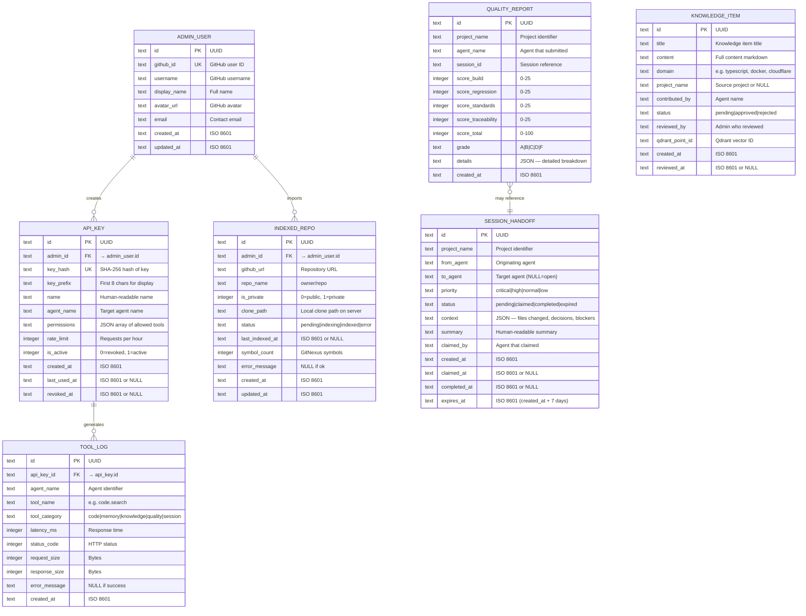

# Entity Relationship Diagram — Cortex Hub

> This ERD covers the **SQLite application database** only. Qdrant has its own schema managed by its service.



## Indexes

```sql
-- Performance-critical queries
CREATE INDEX idx_tool_log_created ON tool_log(created_at DESC);
CREATE INDEX idx_tool_log_agent ON tool_log(agent_name, created_at DESC);
CREATE INDEX idx_tool_log_tool ON tool_log(tool_name, created_at DESC);
CREATE INDEX idx_tool_log_key ON tool_log(api_key_id);
CREATE INDEX idx_api_key_hash ON api_key(key_hash);
CREATE INDEX idx_api_key_active ON api_key(is_active);
CREATE INDEX idx_quality_project ON quality_report(project_name, created_at DESC);
CREATE INDEX idx_handoff_status ON session_handoff(status, priority);
CREATE INDEX idx_repo_status ON indexed_repo(status);
CREATE INDEX idx_knowledge_status ON knowledge_item(status);
```

## Notes

- All IDs are UUIDs v4 (not auto-increment) — compatible with distributed systems
- All timestamps are ISO 8601 strings stored as TEXT
- Soft deletes not needed in v1 — hard delete with revoked_at/expired status instead
- WAL mode enabled for concurrent read/write performance
- Total tables: 7 (lean schema for v1)
